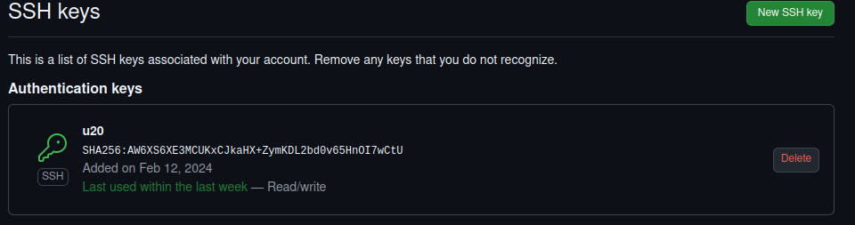

# Configuración de git

He instalado git y he configurado mi perfil añadiendo mi lugar de trabajo, nombre y foto. 
También he configurado mi email y mi nick en git para que aparezcan en mis commits con los siguientes comandos:

'''
git config --global user.name "albertotc99"
git config --global user.email albertojtc99@gmail.com
'''

## configuración de SSH para GitHub

La configuración de SSH para GitHub es muy simple siguiendo los tutoriales que proporciona GitHub. No se entra más en detalle en el proceso de configuración ya que en las siguientes referencias está explicado de manera precisa.

- [Tutorial para configurar SSH con GitHub](https://docs.github.com/es/authentication/connecting-to-github-with-ssh/adding-a-new-ssh-key-to-your-github-account)
- [Tutorial para generación de claves público/privada](https://docs.github.com/es/authentication/connecting-to-github-with-ssh/generating-a-new-ssh-key-and-adding-it-to-the-ssh-agent)

Muestra de clave pública en mi cuenta de GitHub:

